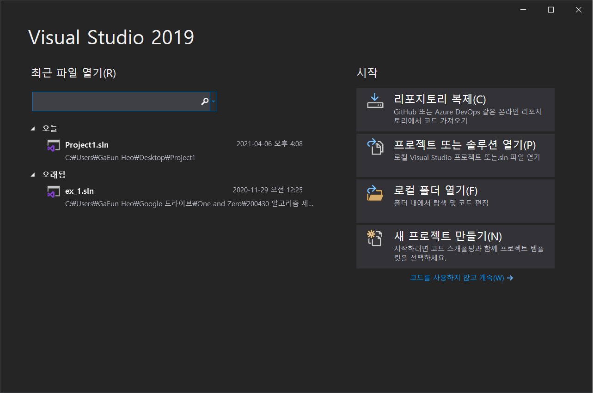

# Week 1 | Hello World! 와 기본 문법

> Hello World!를 출력해보고 C언어의 기본적인 문법을 알아봅니다.
자료형 | 변수설정 | 입출력 | 연산자

**[수업 목표]**

1. 프로그래밍과 C언어에 대해 이해한다
2. "Hello, World!"를 출력해본다.
3. C언어의 기초 문법을 이해한다.

**[목차]**

모든 토글을 열고 닫는 단축키
Windows : `Ctrl` + `alt` + `t` 
Mac : `⌘` + `⌥` + `t` 

---

## 01. 프로그래밍이란 무엇인가?

컴퓨터한테 내가 하고싶은 일을 시키는 방법

## 02. 왜 C언어인가?

[참고자료](https://dojang.io/mod/page/view.php?id=753)

> "메모리를 제어할 수 있는 프로그래밍 언어라서 중요해요

## 03. 무작정 따라하기 | printf("Hello World!");

- **1) 프로젝트 만들기**
    1. 먼저 visual studio를 엽니다.

    

    2. 새 프로젝트 만들기 클릭

    

    3. 빈 프로젝트 클릭

    

    4. 이름과 원하는 위치를 지정하세요. 

    

    5. 프로젝트가 생성됩니다.

    

    6. 소스파일(오른쪽마우스)>추가>새항목

    

    7. 원하는 파일이름과 확장자 .c 지정 후 추가

    

    C언어를 작동시킬 수 있는 파일을 만들 수 있습니다.

- **2) 다음의 코드를 입력하세요.**
    - [코드스니펫] - 01_Hello World!

        ```c
        #include<stdio.h>

        int main(void) {
        printf("Hello, World!");
        return 0;
        }
        ```

## 04. C언어의 기본 문법

- **1) C언어의 기본 문법**
    - (1) 세미콜론

        C 언어는 구문이 끝날 때 ; (세미콜론)을 붙입니다.

        ```c
        printf("Hello, world\n");
        ```

    - (2) 주석

        C 언어에서 사람만 알아볼 수 있도록 작성하는 부분을 주석(comment)라고 합니다. 즉, 주석은 컴파일러가 처리하지 않으므로 프로그램의 실행에는 영향을 주지 않습니다.

        ```c
        // Hello, world! 출력
        printf("Hello, world!\n");

        //주석

        /* 여러 줄 주석 시작

        여러 줄 주석 끝*/
        printf();

        /*
        printf("Hello, world!\n");
        printf("1234567890");
        */
        ```

    - (3) 중괄호

        C 언어는 여러 문법에서 { } (중괄호)를 많이 사용하는데 보통 중괄호는 코드의 범위를 나타냅니다.

        ```c
        int main()
        {   printf("Hello, world!\n");

            return 0;
        }
        ```

    - (4) 들여쓰기

        C 언어로 소스 코드를 작성하다 보면 키워드에 따라서 들여쓰기를 하는 경우가 많습니다. 보통 { (여는 중괄호)가 시작될 때 들여쓰기를 합니다.

        들여쓰기를 하지 않더라도 컴파일 에러는 발생하지 않지만, 코드를 쉽게 알아볼 수 있어야 하므로 들여쓰기는 필수입니다. 항상 적절한 들여쓰기를 하는 습관을 길러주세요.

## 05. 자료형

- **1) 숫자**
    - 정수형

        char, int

        - 정수형 변수 사용하기

            ```c
            #include <stdio.h>

            int main()
            {
                char num1 = -10;
                // 1바이트 정수형으로 변수를 선언하고 값 할당
                int num2 = -1234567890;
                // 4바이트 부호 있는 정수형으로 변수를 선언하고 값 할당

            /*1바이트 정수형이란|
            bit : 비트(bit, binary digit)는 하나의 비트는 0이나 1의 값을 가질 수 있고, 각각은 참, 거짓 혹은 서로 배타적인 상태를 나타낸다.
            byte : 비트가 여러 개 모인 것으로, 통상적으로 8비트를 나타낸다.
            1바이트 정수형 : 8비트로 나타낼 수 있는 정수. signed(부호 있음) 1바이트 정수형의 경우, -128~127의 범위를 표현 가능.
            4바이트 정수형 : 32비트로 나타낼 수 있는 정수. signed(부호 있음) 4바이트 정수형의 경우, -2^31 ~ 2^31의 범위를 표현 가능.

            보통 범위가 부족할일은 없을거예요
            필요하다면 long, long long 검색!
            */

                printf("%d %d\n", num1, num2);
                // -10 -1234567890

                return 0;
            }
            ```

    - 실수형

        float

        - 실수형 변수 사용하기

            ```c
            #include <stdio.h>

            int main()
            {
                float num1 = 0.1;
                // 실수형 변수를 선언하고 값 할당

            /*
            flaot : 4바이트 실수형.32비트	1.175494e-38~3.402823e+38	7	IEEE 754 단정밀도부동소수점.
            보통 범위가 부족할일은 없을거예요
            필요하다면 double, long double 검색!
            */

                printf("%f\n", num1);
                // 0.1
                return 0;
            }
            ```

    - signed / unsigned

        부호 여부에 대한 정보입니다. 보통 signed를 사용합니다.

- **2) 문자**
    - char

        C 언어에서는 정수 자료형인 char를 이용하여 문자 한 개를 저장합니다. 다음은 문자 자료형의 크기와 저장할 수 있는 범위입니다.

        ```c
        #include <stdio.h>

        int main()
        {
        char c1 ='a';    // 문자 변수를 선언하고 문자 a를 저장
        char c2 ='b';    // 문자 변수를 선언하고 문자 b를 저장

            // char를 %c로 출력하면 문자가 출력되고, %d로 출력하면 정숫값이 출력됨
            printf("%c, %d\n", c1, c1);    // a, 97: a의 ASCII 코드값은 97
            printf("%c, %d\n", c2, c2);    // b, 98: b의 ASCII 코드값은 98

            return 0;
        }
        ```

        잠깐, char 가 정수도 되고, 문자도 된다고요?

        char에 문자를 저장할 때는 문자 자체를 저장하는 것이 아니라 문자에 해당하는 정숫값을 저장하게 됩니다.

    - 아스키(ASCII) 코드

        

    주의 !!

    string과 char에 입력값을 넣을 때 혼동하지 말아야 합니다.

    char는 한 문자, 작은따옴표('')로 묶습니다.

    string은 여러 문자(단어), 큰따옴표("")로 묶습니다.

## 06. 변수

- **1) 변수**
    - 변수 만들고 값 저장하기

        변수는 `자료형 변수명` 으로 선언합니다.

        ```c
        #include <stdio.h>

        int main()
        {
            int num1;    // 정수형 변수 선언
            int num2;
            int num3;

            num1 = 10;   // 변수에 값 할당(저장)
            num2 = 20;
            num3 = 30;

            printf("%d %d %d\n", num1, num2, num3); // 10 20 30: 변수에 저장된 값을 %d로 출력

            return 0;
        }
        ```

        변수는 한번에 여러 개를 선언할 수도 있습니다.

        ```c
        #include <stdio.h>

        int main()
        {
        int num1, num2, num3;// 변수를 콤마로 구분하여 변수 여러 개를 선언

            num1 = 10;    // 변수에 값 할당
            num2 = 20;
            num3 = 30;

            printf("%d %d %d\n", num1, num2, num3);
        // 10 20 30: 변수에 저장된 값을 %d로 출력

            return 0;
        }
        ```

## 07. 기본적인 입/출력

- **1) 출력**
    - 정수 출력하기

        ```c
        #include <stdio.h>

        int main()
        {
            int num = 10;
            printf("%d\n", num); // 10 : 변수에 저장된 값을 %d로 출력

            // printf("출력하는 방법", 출력할 변수);

            return 0;
        }
        ```

        정수로 저장된 값을 출력할 땐 %d를 사용합니다.

    - 실수 출력하기

        ```c
        #include <stdio.h>

        int main()
        {
            float num = 0.1;
            printf("%f\n", num); // 0.1 : 변수에 저장된 값을 %f로 출력

            return 0;
        }
        ```

        실수로 저장된 값을 출력할 땐 %f를 사용합니다.

    - 문자 출력하기

        ```c
        #include <stdio.h>

        int main()
        {
            char a = 'A';
            printf("%c\n", a); // A : 변수에 저장된 값을 %s로 출력

            return 0;
        }
        ```

        문자로 저장된 값을 출력할 땐 %c를 사용합니다.

        ```c
        include <stdio.h>

        int main()
        {
            char a[20] = "Hello, world!";
            printf("%s\n", a); // A : 변수에 저장된 값을 %s로 출력

            return 0;
        }
        ```

        문자열에 저장된 값을 출력할 땐 %s를 사용합니다.

        [문자열 다루기](https://www.notion.so/Week-3-Array-b3d47e1129a84457b977cf8d05ced7a7)

- **2) 입력**
    - 다양한 자료형 입력받기

        ```c
        #include <stdio.h>

        int main()
        {
            int num1; //입력을 받을 땐 반드시 입력받을 변수를 먼저 선언합니다.
            float num2;
            char str[10];

            scanf("%d", &num1);
            scanf("%f", &num2);
            scanf("%s", &str);
        // scanf("자료형", &입력받을 변수); 형태로 입력합니다.

            printf("%d %f %s\n", num1, num2, str);
        // printf를 쓸 때 scanf와 혼동하여 &를 쓰지 않도록 주의합니다.

            return 0;
        }
        ```

        위와 같이 다양한 자료형을 입력받을 수 있습니다.

    - 한번에 두 개 이상의 입력받기

        ```c
        #include <stdio.h>

        int main()
        {
            int num1, num2;

            scanf("%d %d", &num1, &num2);
        // 한 번에 두 개 이상의 변수를 입력받을 수 있습니다.

            printf("%d %d\n", num1, num2);
        // printf를 쓸 때 scanf와 혼동하여 &를 쓰지 않도록 주의합니다.

            return 0;
        }
        ```

    - 자리수 정해 입력받기

        ```c
        #include <stdio.h>

        int main()
        {
            int num1, num2;

            scanf("%1d%2d", &num1, &num2);
        // num1에 1자리 수, num2에 2자리 수를 입력받게 됩니다.

            printf("%d %d\n", num1, num2);
        // printf를 쓸 때 scanf와 혼동하여 &를 쓰지 않도록 주의합니다.

            return 0;
        }
        ```

    - Scanf 오류

        

        scanf로 코드 작성 시 위와 같은 오류가 나타날 수 있습니다.

        ### 해결방법

        1. 프로젝트>프로젝트 속성으로 들어갑니다.

        

        2. 구성속성>C/C++>일반

        

        3. SDL검사 아니요 설정

        

        해결!

## 08. 연산자

- **1) 산술 연산자**

    ```c
    #include <stdio.h>

    int main()
    {
        printf("%d\n", 2+7); // 9
        printf("%d\n", 7-2); // 5
        printf("%d\n", 2*7); // 14
        printf("%d\n", 7/2); // 3
        printf("%d\n", 7%2); // 1

        return 0;
    }
    ```

- **2) 증감 연산자**

    ```c
    #include <stdio.h>

    int main()
    {
        int i = 0;
        printf("%d\n", i++); // 0
    // i = 1 ++ => +1  -- => -1
        printf("%d\n", i); // 1
        printf("%d\n", ++i); // 2
        printf("%d\n", i);// 2
        printf("%d\n", i--); // 2
        printf("%d\n", i); // 1

    // for (int i = 0; i<10; i++)

        return 0;
    }
    ```

- **3) 할당 연산자**

    ```c
    #include <stdio.h>

    int main()
    {
        int k = 5;
        k += 3;
        printf("%d\n", k); // 8
        k -= 2;
        printf("%d\n", k); // 6
    // 곱하기, 나누기, 나머지 구하기도 가능.

        k %= 5;
        printf("%d\n", k); // 1
        return 0;
    }
    ```

- **4) 관계 연산자**

    ```c
    #include <stdio.h>

    int main()
    {
        int num = 5;
        printf("%d\n", num >= 5); // 1
        printf("%d\n", num > 5); // 0
        printf("%d\n", num != 5); // 0
        if(num > 5){
    //code;
        }

        return 0;
    }
    ```

- **5) 논리 연산자**

    ```c
    #include <stdio.h>

    int main()
    {
        int num = 5;
        printf("%d\n", num > 3 && num < 10); // 1
        printf("%d\n", num > 3 || num > 10); // 1

        return 0;
    }
    ```

- **6) 비트 연산자**

    Do It Yourself!

## 09. 과제 안내

- **HW 1. 세자릿수의 숫자 순서를 바꾸어 출력하는 프로그램을 제작하세요.**

    ex)

    Enter a three-digit number: 986

    The reversal is : 689

    

- **HW 2. Fahrenheit(화씨)온도를 Celsius(섭씨) 온도로 바꾸어 출력해주는 프로그램을 제작하세요. 단, 섭씨 온도는 소수점 둘째자리까지 표현됩니다.**

    ex)

    Enter Fahrenheit temperature: 89

    Celsius equivalent: 31.67

- **FAQ**
    - 띄어쓰기를 해서 입력해야 코드가 돌아갑니다.

        scanf("%1d%2d%3d", &num1, &num2, &num3); 라고 작성하셨나요? d앞의 숫자는 **"몇 자리수"**를 입력받을지를 결정합니다. 이 코드의 경우 공백을 포함한 여섯개의 입력에 대해 처리하므로, 띄어쓰기를 해서 입력을 5개로 만들어줘야 넘어가게됩니다.

        scanf("%1d%1d%1d", &num1, &num2, &num3); 로 바꿔주면 됩니다.

    - 한 프로젝트 안에 여러개의 C파일을 돌리고싶습니다.

        안됩니다.... 혹시 서칭을 통해 방법을 발견했다면 저한테도 알려주세요 궁금합니다.

과제는 hw1.c, hw2.c 파일과 작동 모습의 스크린샷을 하나의 파일에 압축하여  hge2020@korea.ac.kr 로 제출하시면 됩니다.

과제 중 질문이 있다면 카카오톡이나 메일 등 편한 곳으로 해주세요!

과제 기한 : 2021.05.21 21:00까지